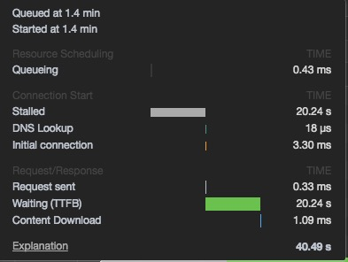

### 问题出现

开发反馈错误时间过长

发现所有错误请求都被发送了两次，情况是

- 浏览器中发现只有一次请求

- 服务器上发现有两条请求日志

### 排查过程

首先为乐确认问题是在 nginx 转发时发生的，还是由浏览器发送的

只能使用抓包的方式进行排查，重新修改了服务器，关闭了 https

使用 wireshark 进行抓包

```wireshark
ip == 10.1.108.31 && ip.port = 80 && http
```

检查发现是由浏览器发送了两次请求

分别使用了不同浏览器测试：

- Firefox 两次
- Chrome 两次
- Safari 正常
- IE 正常

检查了请求和响应

查看 chrome 网络 waterfall



查看发现，时间显示 stalled 时有一次请求

之后 walting 时间段是重试的请求

测试了是否是 keepalive 的原因，`nginx.conf`设置：

```nginx
keepalive_timeoute 0;
```

排除原因

使用了[`echo`](https://github.com/gsmlg/echo)服务进行测试

通过测试发现，当服务器响应 421 时，浏览器会复制请求并再次请求服务器

### 原因

查看了 `http status code 421` 说明

      421 Misdirected Request （RFC 7540）
        该请求针对的是无法产生响应的服务器（例如因为连接重用）。

RFC 7540 Hypertext Transfer Protocol Version 2 (HTTP/2) [链接](https://tools.ietf.org/html/rfc7540)

指定说明[Section](https://tools.ietf.org/html/rfc7540#section-9.1.2)

      9.1.2.  The 421 (Misdirected Request) Status Code

      The 421 (Misdirected Request) status code indicates that the request
      was directed at a server that is not able to produce a response.
      This can be sent by a server that is not configured to produce
      responses for the combination of scheme and authority that are
      included in the request URI.

      Clients receiving a 421 (Misdirected Request) response from a server
      MAY retry the request -- whether the request method is idempotent or
      not -- over a different connection.  This is possible if a connection
      is reused (Section 9.1.1) or if an alternative service is selected
      [ALT-SVC].

      This status code MUST NOT be generated by proxies.

      A 421 response is cacheable by default, i.e., unless otherwise
      indicated by the method definition or explicit cache controls (see
      Section 4.2.2 of [RFC7234]).

#### 确定原因

http2 中定义了 421 错误

##### 421 错误用于在 http2 中，在 http2 复用连接时，发现连接到的服务器不正确，则会由服务器返回响应码 421，客户端收到后会重新建立连接并且发送相同的请求

### 解决方式

使用通用的错误响应码`403`即可解决问题
