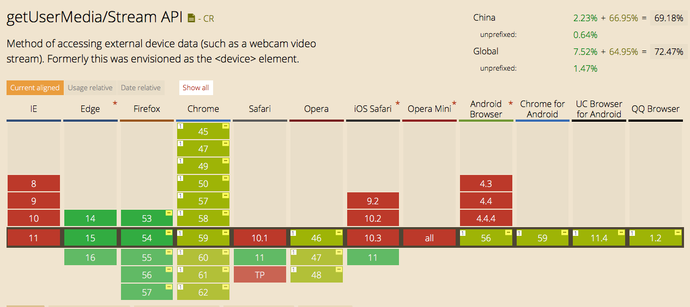

## HTML5 访问视频和音频输入设备

### API: `Navigator.MediaDevices.getUserMedia()`

#### 语法：

```
var promise = navigator.mediaDevices.getUserMedia(constraints);
```

#### 参数： _constraints_

可以配置为如下：

```
navigator.mediaDevices.getUsermedia({video: true, audio: true});

navigator.mediaDevices.getUsermedia({video: {width: 800, height: 480}, audio: true});

navigator.mediaDevices.getUsermedia({audio: true,video:  {
    width: { min: 1024, ideal: 1280, max: 1920 },
    height: { min: 776, ideal: 720, max: 1080 }
  }});

// 移动设备
// 前置摄像头
navigator.mediaDevices.getUsermedia({ audio: true, video: { facingMode: "user" } })

// 确认主摄像头
navigator.mediaDevices.getUsermedia({ audio: true, video: { facingMode: { exact: "environment" } } })

// 限制帧数
navigator.mediaDevices.getUsermedia({ video: { frameRate: { ideal: 10, max: 15 } } })

```

#### 返回值

`Promise` 对象

- 成功返回为 [`MediaStream`](https://developer.mozilla.org/en-US/docs/Web/API/MediaStream)

- 失败异常
  - AbortError
  - NotAllowedError
  - NotFoundError
  - NotReadableError
  - OverConstrainedError
  - SecurityError
  - TypeError

### 早期接口为 `navigator.getUserMedia()`

旧浏览器使用示例：

```javascript
// Older browsers might not implement mediaDevices at all, so we set an empty object first
if (navigator.mediaDevices === undefined) {
  navigator.mediaDevices = {};
}

// Some browsers partially implement mediaDevices. We can't just assign an object
// with getUserMedia as it would overwrite existing properties.
// Here, we will just add the getUserMedia property if it's missing.
if (navigator.mediaDevices.getUserMedia === undefined) {
  navigator.mediaDevices.getUserMedia = function (constraints) {
    // First get ahold of the legacy getUserMedia, if present
    var getUserMedia =
      navigator.webkitGetUserMedia || navigator.mozGetUserMedia;

    // Some browsers just don't implement it - return a rejected promise with an error
    // to keep a consistent interface
    if (!getUserMedia) {
      return Promise.reject(
        new Error('getUserMedia is not implemented in this browser'),
      );
    }

    // Otherwise, wrap the call to the old navigator.getUserMedia with a Promise
    return new Promise(function (resolve, reject) {
      getUserMedia.call(navigator, constraints, resolve, reject);
    });
  };
}

navigator.mediaDevices
  .getUserMedia({ audio: true, video: true })
  .then(function (stream) {
    var video = document.querySelector('video');
    // Older browsers may not have srcObject
    if ('srcObject' in video) {
      video.srcObject = stream;
    } else {
      // Avoid using this in new browsers, as it is going away.
      video.src = window.URL.createObjectURL(stream);
    }
    video.onloadedmetadata = function (e) {
      video.play();
    };
  })
  .catch(function (err) {
    console.log(err.name + ': ' + err.message);
  });
```

### 兼容情况


