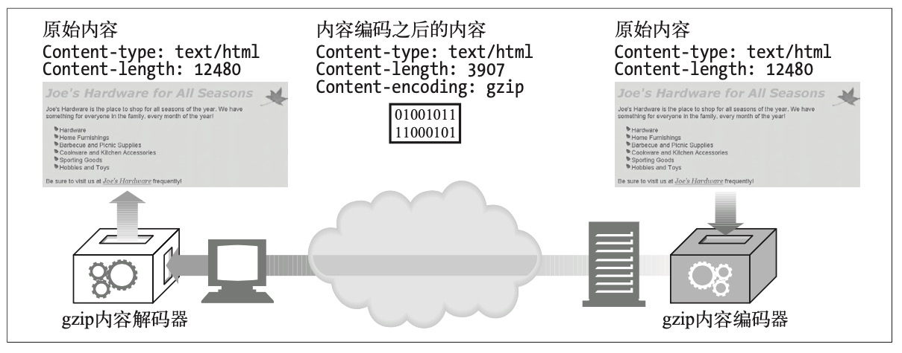
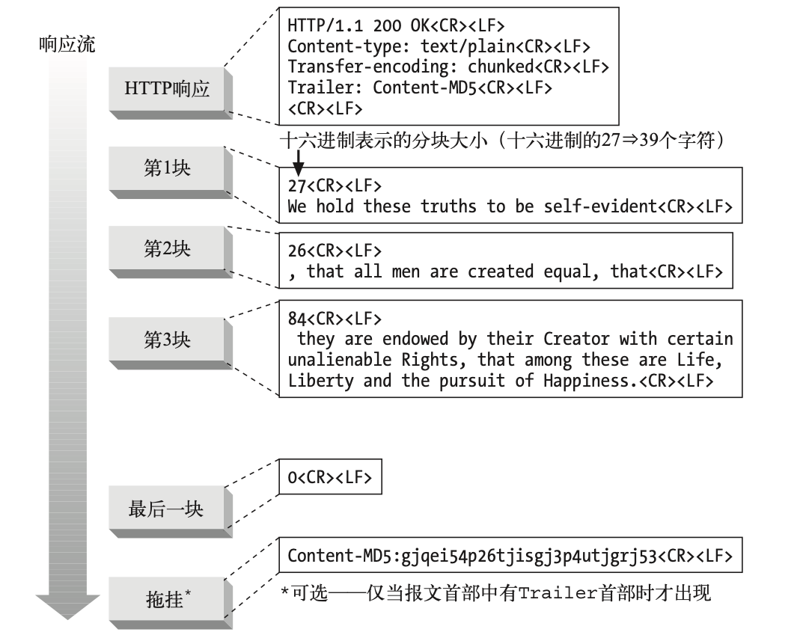

## 实体和编码

报文是箱子，实体是货物

- Example

```http
http/1.0 200 ok
server: GWS
Content-Type: text/plain
Content-length: 18

Hi! I'm a message!
```

从 Content-type 开始到结束都是实体，
header 部分是实体首部，
body 部分是实体主体

HTTP 实体首部描述了 HTTP 报文的内容。
HTTP/1.1 版定义了以下 10 个基本字体首部字段。

- Content-Type 实体中所承载对象的类型。
- Content-Length 所传送实体主体的长度或大小。
- Content-Language 与所传送对象最相配的人类语言。
- Content-Encoding 对象数据所做的任意变换(比如，压缩)。
- Content-Location 一个备用位置，请求时可通过它获得对象。
- Content-Range 如果这是部分实体，这个首部说明它是整体的哪个部分。
- Content-MD5 实体主体内容的校验和。
- Last-Modified 所传输内容在服务器上创建或最后修改的日期时间。
- Expires 实体数据将要失效的日期时间。
- Allow 该资源所允许的各种请求方法，例如，GET 和 HEAD。
- ETag 这份文档特定实例(参见 15.7 节)的唯一验证码。ETag 首部没有正式定义为实 体首部，但它对许多涉及实体的操作来说，都是一个重要的首部。
- Cache-Control 指出应该如何缓存该文档。和 ETag 首部类似，Cache-Control 首部也没有正 式定义为实体首部。

### 确定实体主体长度的规则

1. 如果特定的 HTTP 报文类型中不允许带有主体，就忽略 Content-Length 首 部，它是对(没有实际发送出来的)主体进行计算的。这种情况下，Content- Length 首部是提示性的，并不说明实际的主体长度。(考虑不周的 HTTP 应用 程序会认为有了 Content-Length 就有主体存在，这样就会出问题。)

最重要的例子就是 HEAD 响应。HEAD 方法请求服务器发送等价的 GET 请 求中会出现的首部，但不要包括主体。因为对 GET 的响应会带有 Content- Length 首部，所以 HEAD 响应里面也有;但和 GET 响应不同的是，HEAD 响应中不会有主体。1XX、204 以及 304 响应也可以有提示性的 Content- Length 首部，但是也都没有实体主体。那些规定不能带有实体主体的报文， 不管带有什么首部字段，都必须在首部之后的第一个空行终止。

2. 如果报文中含有描述传输编码的 Transfer-Encoding 首部(不采用默认的 HTTP“恒等”编码)，那实体就应由一个称为“零字节块”(zero-byte chunk) 的特殊模式结束，除非报文已经因连接关闭而结束。我们将在本章后面讨论传 输编码和分块编码。

3. 如果报文中含有 Content-Length 首部(并且报文类型允许有实体主体)，而且没有非恒等的 Transfer-Encoding 首部字段，那么 Content-Length 的值就是主体的长度。如果收到的报文中既有 Content-Length 首部字段又有非恒等的 Transfer-Encoding 首部字段，那就必须忽略 Content-Length，因为 传输编码会改变实体主体的表示和传输方式(因此可能就会改变传输的字节数

4. 如果报文使用了 multipart/byteranges(多部分 / 字节范围)媒体类型，并且没有用 Content-Length 首部指出实体主体的长度，那么多部分报文中的每个部 分都要说明它自己的大小。这种多部分类型是唯一的一种自定界的实体主体类 型，因此除非发送方知道接收方可以解析它，否则就不能发送这种媒体类型。

- 因为 Range 首部可能会被不理解多部分 / 字节范围的更原始的代理所转发，所以如果发送方不能确 定接收方是否理解这种自定界的格式的话，就必须用本节的方法(1)、(3)或(5)来对报文定界。

5. 如果上面的规则都不匹配，实体就在连接关闭的时候结束。实际上，只有服务 器可以使用连接关闭来指示报文的结束。客户端不能用关闭连接来指示客户端

- 客户端可以使用半关闭，也就是只把连接的输出端关闭，但很多服务器应用程序设计的时候没有考虑 到处理这种情况，会把半关闭当作客户端要从服务器断开连接来处理。HTTP 没有对连接管理进行良 好的规范。详情请参见第 4 章。

### 媒体类型和字符集

Content-Type 首部字段说明了实体主体的 MIME 类型。
MIME 类型是标准化的名字，用以说明作为货物运载实体的基本媒体类型。
客户端应用程序使用 MIME 类型来解释和处理其 内容。

Content-Type 的值是标准化的 MIME 类型，都在互联网号码分配机构(Internet Assigned Numbers Authority，简称 IANA)中注册。
MIME 类型由一个主媒体类 型(比如:text、image 或 audio 等)后面跟一条斜线以及一个子类型组成，子类 型用于进一步描述媒体类型。

### 内容编码



#### 内容编码类型

HTTP 定义了一些标准的内容编码类型，并允许用扩展编码的形式增添更多的编码。
由互联网号码分配机构(IANA)对各种编码进行标准化，它给每个内容编码算法分 配了唯一的代号。

- gzip RFC1952 gzip 编码
- compress Unix 文件压缩
- deflate RFC1950 和 1951 讲解 zlib 和 deflate
- identity 没有编码

#### Accept-Encoding

为了避免服务器使用客户端不支持的编码方式，
客户端就把自己支持的内容编码方式列表放在请求的 Accept-Encoding 首部里发出去。
如果 HTTP 请求中没有包含 Accept-Encoding 首部，
服务器就可以假设客户端能够接受任何编码方式(等价 于发送 Accept-Encoding: \*)。

Example:

```http
Accept-Encoding: compress, gzip
Accept-Encoding:
Accept-Encoding: *
Accept-Encoding: compress;q=0.5, gzip;q=1.0
Accept-Encoding: gzip;q=1.0, identity; q=0.5, *;q=0
```

Q 值的范围从 0.0 到 1.0，0.0 说明客户端不想接受所说明的编码，1.0 则表明最希望使用的编码。
“\*”表示“任何其他方法”。

### 传输编码和分块编码

传输编码也是作用在实体主体上的可逆变换，但使用它们是由 于架构方面的原因，同内容的格式无关。


#### 可靠传输

- 未知尺寸
  如果不先生成内容，某些网关应用程序和内容编码器就无法确定报文主体的最终 大小。
  通常，这些服务器希望在知道大小之前就开始传输数据。
  因为 HTTP 协议 354 要求 Content-Length 首部必须在数据之前，
  有些服务器就使用传输编码来发送数据，
  并用特别的结束脚注表明数据结束。
- 安全性
  你可以用传输编码来把报文内容扰乱，然后在共享的传输网络上发送。

#### Transfer-Encoding Headers

- Transfer-Encoding
  告知接收方为了可靠地传输报文，已经对其进行了何种编码。
- TE
  用在请求首部中，告知服务器可以使用哪些传输编码扩展。

请求使用了 TE 首部来告诉服务器它可以接受分块编码(如果是 HTTP/1.1 应用程序的话，
这就是必须的)并且愿意接受附在分块编码的报文结尾上的拖挂:

```http
GET /new_products.html HTTP/1.1
Host: www.gsmiot.com
User-Agent: Mozilla/4.61 [en] (WinNT; I)
TE: trailers, chunked
...
```

#### 分块编码

分块编码把报文分割为若干个大小已知的块。块之间是紧挨着发送的，这样就不需
要在发送之前知道整个报文的大小了。



### 随时间变化的实例

HTTP 协议规定了称为实例操控(instance manipulations)的一系列请求和响应操 作，用以操控对象的实例。
两个主要的实例操控方法是范围请求和差异编码。
这两 种方法都要求客户端能够标识它所拥有(如果有的话)的资源的特定副本，并在一定的条件下请求新的实例。

### 验证码和新鲜度

服务器应当告知客户端能够将内容缓存多长时间，在这个时间之内就是新鲜的。
服务器可以用这两个首部之一来提供这种信息:

- Expires(过期)
- Cache- Control(缓存控制)

#### 有条件的请求与验证码

| 请求类型            | 验证码        | 描述                                                                                     |
| ------------------- | ------------- | ---------------------------------------------------------------------------------------- |
| If-Modified-Since   | Last-Modified | 如果在前一条响应的 Last-Modified 首部中说明的 时间之后，资源的版本发生变化，就发送其副本 |
| If-Unmodified-Since | Last-Modified | 仅在前一条响应的 Last-Modified 首部中说明的时 间之后，资源的版本没有变化，才发送其副本   |
| If-Match            | ETag          | 如果实体的标记与前一次响应首部中的 ETag 相同， 就发送该资源的副本                        |
| If-None-Match       | ETag          | 如果实体的标记与前一次响应首部中的 ETag 不同， 就发送该资源的副本                        |

### 范围请求

有了范围请求，HTTP 客户端可以通过请求曾获取失败的实体的一个范围(或者说 一部分)，来恢复下载该实体。

Example:

```http
GET /bigfile.html HTTP/1.1
Host: www.gsmiot.com
Range: bytes=4000-
User-Agent: Mozilla/4.61 [en] (WinNT; I)
...
```

对于客户端在一个请求内请求多个不同范围的情况，返回的响应也是单个实体，
它有一个多部分主体及 Content-Type: multipart/byteranges 首部。

服务器可以通过在响应中包含 Accept-Ranges 首部的形式向客户端说明可以接受的范围请求。
这个首部的值是计算范围的单位，通常是以字节计算的。

### 差异编码

差异编码也是一类实例操控，因为它依赖客户端和服务器之间针对特定的对象实例来交换信息。RFC 3229 描述了差异编码。

如果客户端想告诉服务器它愿意接受该页面的差异，只要发送 A-IM 首部就可以了。
A-IM 是 Accept-Instance-Manipulation(接受实例操控)的缩写。
形象比喻的话，客户端相当于这样说:“哦对了，我能接受某些形式的实例操控，
如果你会其中一种的话，就不用发送完整的文档给我了。”
在 A-IM 首部中，客户端会说明它知道哪些算法可以把差异应用于老版本而得到最新版本。
服务端发送回下面这些内容:
一个特殊的响应代码——226 IM Used，
告知客户端它正在发送的是所请求对象的实例操控，而不是那个完整的对象自身;
一个 IM(Instance-Manipulation 的缩写) 首部，说明用于计算差异的算法;
新的 ETag 首部和 Delta-Base 首部，说明用于计算差异的基线文档的 ETag(理论上，它应该和客户端之前请求里的 If-None- Match 首部中的 ETag 相同!)。

差异编码所用的首部

| 首部          | 描述                                                                                                             |
| ------------- | ---------------------------------------------------------------------------------------------------------------- |
| ETag          | 文档每个实例的唯一标识符。由服务器在响应中发送;客户端在后继请求的 If-Match 首部和 If-None-Match 首部中可以使用它 |
| If-None-Match | 客户端发送的请求首部，当且仅当客户端的文档版本与服务器不同时，才向服务 器请求该文档                              |
| A-IM          | 客户端请求首部，说明可以接受的实例操控类型                                                                       |
| IM            | 服务器响应首部，说明作用在响应上的实例操控的类型。当响应代码是 226 IM Used 时，会发送这个首部                    |
| Delta-Base    | 服务器响应首部，说明用于计算差异的基线文档的 ETag 值(应当与客户端请求中的 If-None-Match 首部里的 ETag 相同)      |

**实例操控、差异生成器和差异应用器**

客户端可以使用 A-IM 首部说明可以接受的一些实例操控的类型。
一些在 IANA 注册的实例操控类型。

| 类型     | 说明                                                                        |
| -------- | --------------------------------------------------------------------------- |
| vcdiff   | 用 vcdiff 算法计算差异 (vcdiff 的规范由 RFC3284 发布)                       |
| diffe    | 用 Unix 系统的 diff-e 命令计算差异                                          |
| gdiff    | 用 gdiff 算法计算差异 [link](http://www.w3.org/TR/NOTE-gdiff-19970901.html) |
| gzip     | 用 gzip 算法压缩                                                            |
| deflate  | 用 deflate 算法压缩                                                         |
| range    | 用在服务器的响应中，说明响应是针对范围选择得到的部分内容                    |
| identity | 用在客户端请求中的 A-IM 首部中，说明客户端愿意接受恒等实例操控              |

### 更多信息

关于实体和编码方面的更多信息，请参考以下资源。

- http://www.ietf.org/rfc/rfc2616.txt
  RFC 2616，也就是 HTTP/1.1 版的规范，是实体主体管理和编码方面的主要参考。
- http://www.ietf.org/rfc/rfc3229.txt
  RFC 3229，“Delta Encoding in HTTP”(“HTTP 中的差异编码”)，说明了如何通 过扩展 HTTP/1.1 来支持差异编码。
- Introduction to Data Compression11(《数据压缩导论》)
  这本书的作者是 Khalid Sayood，出版商为 Morgan Kaufmann Publishers。该书介 绍了几种 HTTP 内容编码支持的压缩算法。
- http://www.ietf.org/rfc/rfc1521.txt
  RFC 1521，“Multipurpose Internet Mail Extensions, Part One: Mechanisms for Specifying and Describing the Format of Internet Message Bodies”(“ 多 用 途 因 特网邮件扩展，第一部分:规定和描述因特网报文主体格式的机制”)，描述了 MIME 主体的格式。
  这份参考材料很有用，因为 HTTP 从 MIME 中借用了大量内容。设计这份文档的目的，就是为了提供在单一报文中包含多个对象的各种设施，比如用 US-ASCII 之外的字符集来表示主体文本，表示多种字体格式的文本消息以及表示非文本类的信息，比如图像和声音片段等。
- http://www.ietf.org/rfc/rfc2045.txt
  RFC 2045，“Multipurpose Internet Mail Extensions, Part One: Format of Internet Message Bodies”(“多用途因特网邮件扩展，第一部分:因特网报文主体的格 式”)，规定了用来描述 MIME 格式报文结构的各种首部，其中许多都和 HTTP 中的用法类似或相同。
- http://www.ietf.org/rfc/rfc1864.txt
  RFC 1864，“The Content-MD5 Header Field”(“Content-MD5 首部字段”)，提 供了用 Content-MD5 首部字段来做报文完整性检查的行为及用途方面的一些历史 细节。
- http://www.ietf.org/rfc/rfc3230.txt
  RFC 3230，“Instance Digests in HTTP”(“HTTP 中 的 实 例 摘 要 ”)， 描 述 了 对 HTTP 实体摘要处理的改进，解决了 Content-MD5 中存在的各种问题。
