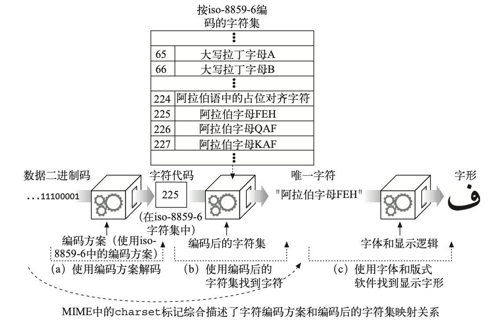

## 国际化

每天有上亿的人用数百种语言写着各种文档。
为了真正实现万维网的目标，HTTP 要能够传输和处理用多种语言和字母表编写的国际性文档。

### HTTP 对国际性内容的支持

服务器通过 HTTP 协议的 Content-Type 首部中的 charset 参数和 Content- Language 首部告知客户端文档的字母表和语言。

客户端发送 Accept-Charset 首部和 Accept-Language 首部，告知服务器 它理解哪些字符集编码算法和语言以及其中的优先顺序。

下面的 HTTP 报文中的这些 Accept 首部可能是母语为法语的人发出的。他喜欢 使用母语，但也会说一点儿英语，他的浏览器支持 iso-8859-1 西欧字符集编码和 UTF-8 Unicode 字符集编码:

```http
Accept-Language: fr, en;q=0.8
Accept-Charset: iso-8859-1, utf-8
```

参数“q=0.8”是质量因子(quality factor)，说明英语的优先级(0.8)比法语低 (默认值是 1.0)。

### 字符集与 HTTP

#### 字符集是把字符转换为二进制码的编码

HTTP 字符集的值说明如何把实体内容的二进制码转换为特定字母表中的字符。
每个字符集标记都命名了一种把二进制码转换为字符的算法(反之亦然)。
字符集标记在由 IANA 维护([参见](http://www.iana.org/assignments/character-sets))的 MIME 字 符集注册机构进行了标准化。

#### 字符集和编码如何工作

把二进制码转换为字符要经过两个步骤

- 文档中的二进制码被转换成字符代码，它表示了特定编码字符集中某个特定编号的字符。
- 字符代码用于从编码的字符集中选择特定的元素。



#### 标准化的 MIME charset 值

特定的字符编码方案和特定的已编码字符集组合成一个 MIME 字符集(MIME charset)。
HTTP 在 Content-Type 和 Accept-Charset 首部中使用标准化的 MIME charset 标记。
MIME charset 的值都会在 IANA 注册。

#### Content-Type 首部和 Charset 首部以及 META 标志

Web 服务器通过在 Content-Type 首部中使用 charset 参数把 MIME 字符集标记
发送给客户端:

```http
Content-Type: text/html; charset=gb2312
```

对于 HTML 内容来说， 可以在描述 charset 的

```html
<meta http-equiv="Content-Type" />
```

标记中找到字符集。

#### Accept-Charset 首部

HTTP 客户端可以使用 Accept-Charset 请求首部来明确告知服务器它支持哪些字 符系统。
Accept-Charset 首部的值列出了客户端支持的字符编码方案。

```http
Accept-Charset: iso-8859-1, utf-8
```

### 多语言字符编码入门

对于工作中要开发大量国际化应用的 HTTP 程序员来说，为了能理解技术规范和相应的实现软件，需要深入地理解多语言字符系统。

#### Terminology

电子化字符系统的 8 个术语

- 字符

字符是指字母、数字、标点、表意文字(比如汉语)、符号，或其他文本形式的书写“原子”。
由统一字符集(Universal Character Set，UCS, 它的非正式的名字是 Unicode3)首创，
为多种语言中的很多字符开发了一系列标准化的文本名称，
它们常用来便捷地命名字符，而且不会与其他字符冲突。

- 字形

描述字符的笔画图案或唯一的图形化形状。如果一个字符有多种不同的写法，就 有多个字形(参见图 16-3)。

- 编码后的字符

分配给字符的唯一数字编号，这样我们就可以操作它了。

- 代码空间

计划用于字符代码值的整数范围。

- 代码宽度

每个(固定大小的)字符代码所用的位数。

- 字符库

特定的工作字符集(全体字符的一个子集)。

- 编码后的字符集

组成字符库(从全球的字符中选出若干字符)的已编码字符集，并为每个字符 分配代码空间中的一个代码。换句话说，它把数字化的字符代码映射为实际的 字符。

- 字符编码方案

把数字化的字符代码编码成一系列二进制码(并能相应地反向解码)的算法。字 符编码方案可用来减少识别字符所需要的数据总量(压缩)、解决传输限制、统 一重叠编码字符集。

### 语言标记与 Http

语言标记是命名口语的标准化字符串短语。

#### Content-Language 首部

实体的 Content-Language 首部字段描述实体的目标受众语言。

```http
Content-Language: zh-CN
```

Content-Language 首部不仅限于文本文档。
音频片段、电影以及应用程序都有可 能是面向特定语言受众的。
任何面向特定语言受众的媒体类型都可以有 Content- Language 首部。

如果内容是面向多种语言受众的，可以列出多种语言。

```http
Content-Language: zh-CN, zh-TW, zh-HK
```

#### Accept-Language 首部

HTTP 允许我们把语言方面的限制和优先选择都发送给网站服务器。
如果网站服务器有以多种语言表示的资源版本，它就能把内容用我们最优选的语言表示出来。

    服务器也可以根据 Accept-Language 首部生成适合用户语言的动态内容，或据此选择图像，或选择适合目标语言的商业促销等。

#### 语言标记的类型

在 RFC3066，“Tags for the Identification of Languages”(标识语言的标记)中记录了语言标记的标准化语法。

可以用语言标记来表示:

- 一般的语言分类(比如 es 代表西班牙语);
- 特定国家的语言(比如 en-GB 代表英国英语);
- 语言的方言(比如 no-bok 指挪威的书面语);
- 地区性的语言(比如 sgn-US-MA 代表美国马撒葡萄园岛上的手语);
- 标准化的非变种语言(比如 i-navajo);
- 非标准的语言(比如 x-snowboarder-slang)。

#### 子标记

语言标记有一个或多个部分，用连字号分隔，称为子标记:

- 第一个子标记称为主子标记，其值是标准化的;
- 第二个子标记是可选的，遵循它自己的命名标准;
- 其他尾随的子标记都是未注册的。

主子标记中只能含有字母(A ~ Z)。
其后的子标记可以含有字母和数字，长度最多 8 个字符。

Example:

```text
马撒葡萄园岛上的手语

sgn-US-MA

sgn -> 第一个子标记 （手语）
US -> 第二个子标记 （美国）
MA -> 第三个子标记 （马萨诸塞州的地区性变体）

```

#### 大小写

所有的标记都是不区分大小写的，也就是说，标记 en 和 eN 是等价的。
但是，习惯上用全小写来表示一般的语言，而用全大写来表示特定的国家。

#### IANA 语言标记注册

第一个和第二个语言子标记的值由各种标准文档以及相关的维护组织定义。
IANA20 依据 RFC 3066 中概括的规则来管理标准的语言标记列表。

如果语言标记由标准的国家和语言值组成，标记就不需要专门注册。
只有那些无法 用标准的国家和语言值构成的语言标记才需要专门向 IANA 注册 21。

#### 第一个子标记--名字空间

第一个子标记通常是标准化的语言记号，选自 ISO 639 中的语言标准集合。
不过也可以用字母 i 来标识在 IANA 中注册的名字，或用 x 表示私有的或者扩展的名字。

- 2 个字符，那就是来自 ISO 63922 和 639-1 标准的语言代码;
- 3 个字符，那就是来自 ISO 639-2 标准及其扩展的语言代码;
- 字母 i，该语言标记是在 IANA 显式注册的;
- 字母 x，该语言标记是私有的、非标准的，或扩展的子标记。

#### 第二个子标记--名字空间

第二个子标记通常是标准化的国家记号，选自 ISO 3166 中的国家代码和地区标准集合。
不过也可以是在 IANA 注册过的其他字符串。

- 2 个字符，那就是 ISO 3166 中定义的国家 / 地区;
- 3~8 个字符，可能是在 IANA 中注册的值;
- 单个字符，这是非法的情况。

#### 其余子标记--名字空间

除了最长可以到 8 个字符(字母和数字)之外，第三个和其后的子标记没有特殊规则。

### 国际化的 URI

直到今天，URI 还没有为国际化提供足够的支持。

#### 全球性的可转抄能力与有意义的字符的较量

URI 的设计者们希望世界上每个人都能通过电子邮件、电话、公告板，甚至无线电来共享 URI。
他们还希望 URI 容易使用和记忆，但这两个目标是相互冲突的。

URI 的设计者们觉得确保资源标识符的可转抄能力(transcribability)和共享能力比让它们由最有意义的字符组成更加重要，
因此(如今的)URI 基本上是由 ASCII 字符的受限子集构成的。

#### URI 字符集合

URI 中允许出现的 US-ASCII 字符的子集，可以被分成保留、未保留以及转义字符 这几类。

未保留的字符可用于 URI 允许其出现的任何部分。
保留的字符在很多 URI 中都有特殊的含义，因此一般来说不能使用它们。

| 字符类别 | 字符列表                        |
| -------- | ------------------------------- |
| 未保留   | [A-Za-z0-9] - \_ . ! ~ \* ' ( ) |
| 保留     | ; / ? : @ & = " \$ ,            |
| 转义     | %<hex><hex>                     |

#### 转义国际化字符

需要注意的是，要转义的值本身应该在 US-ASCII 代码值的范围内(0 ~ 127)。

#### URI 中的模态切换

有些 URI 也用 ASCII 字符的序列来表示其他字符集中的字符。
这在一些本地化的环境中可以工作，但这种方式没有进行良好的定义，
而且没有标准化的方案来识别 URL 所使用的特定编码。

### 其他需要考虑的地方

#### 首部和不合规范的数据

HTTP 首部必须由 US-ASCII 字符集中的字符构成。
不过，并不是所有的客户端和服务器都正确地实现了这一点，你可能会时不时收到一些代码值大于 127 的非法字符。

#### 日期

HTTP 的规范中明确定义了合法的 GMT 日期格式，但要知道并非所有 Web 服务器和客户端都遵守这些规则。

例如，我们曾见过 Web 服务器发送的无效 HTTP Date (日期)首部中的月份是用本地语言表示的。

HTTP 应用程序应当尝试容忍一些不合规矩的日期，不能在接收的时候崩溃。

#### 域名

DNS 目前还不支持在域名中使用国际化的字符。
现在正在进行支持多语言的域名的相关标准化工作，但还没有被广泛部署。

实际国际化域名应该是你用 IDN 来编码，但是在本地 mDNS 时，可能会发送非 ascii 字符。

### 更多信息

#### 互联网的国际化

- http://www.w3.org/International/

“Making the WWW Truly World Wide”(“使 WWW 真正遍布全球”)——W3C
国际化和本地化网站。

- http://www.ietf.org/rfc/rfc2396.txt

RFC 2396，“Uniform Resource Identifiers(URI):Generic Syntax”(“统一资源 描述符:一般语法”)，是 URI 的定义文档。该文档中包括了描述国际化 URI 中 的字符集限制方面的章节。

- CJKV Information Processing(《中日韩越信息处理》)

Ken Lunde 著，由 O'Reilly & Associates 公司出版。CJKV 是亚洲语言的电子化 字符处理方面的权威经典。亚洲语言的字符集多种多样、复杂难懂，但这本书详 细介绍了大型字符集的各种标准技术。

- http://www.ietf.org/rfc/rfc2277.txt

RFC 2277，“IETF Policy on Character Sets and Languages”(“IETF 关于字符集 和语言的策略”)，
其中记录了互联网工程指导组(Internet Engineering Steering Group，IESG)应用的当前策略，
这些策略是为了配合互联网工程任务组 (Internet Engineering Task Force，IETF)帮助各种互联网协议使用多种语言和字符交换数据而做的标准化努力。

#### 国际标准

- http://www.iana.org/numbers.htm

IANA 中有已注册的各种名字和数字编号的库。
其中的 Protocol Numbers and Assignments Directory(协议编号和分配目录)中包含了因特网上使用的已注册 字符集记录。
因为有关国际间通信的大部分工作都是在 ISO 的领域内，而不是因 特网的团体完成的，所以 IANA 的这份列表算不上详尽。

- http://www.ietf.org/rfc/rfc3066.txt

RFC 3066，“Tags for the Identification of Languages”(“标识语言的标记”)，描 述了语言标记、它们的值，以及如何构造这些标记。

- “Codes for the representation of names of languages”(“表示语言名称的代码”)

ISO 639:1988 (E/F)，国际标准化组织，第 1 版。

- “Codes for the representation of names of languages—Part 2: Alpha-3 code”(“表 示语言名称的代码，第 2 部分:Alpha-3 代码”)

ISO 639-2:1998，ISO TC46/SC4 和 TC37/SC2 联合工作组，第 1 版。

- “Codes for the representation of names of countries”(“表示国家名称的代码”)

ISO 3166:1988 (E/F)，国际标准化组织，第 3 版。
