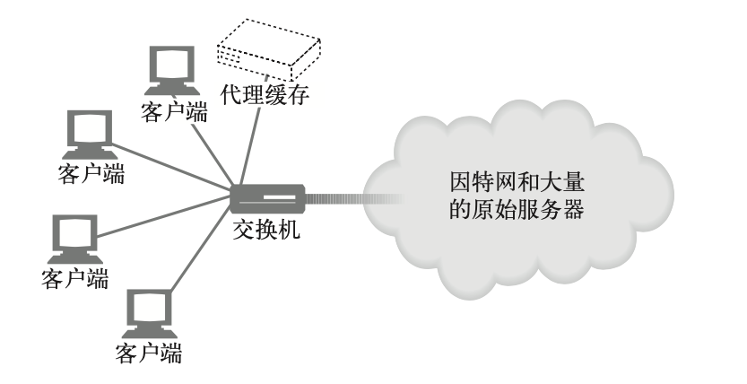
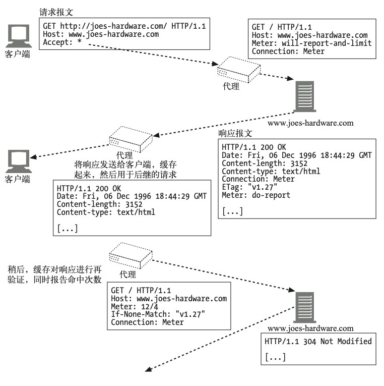

# 内容发布与分发

## 主机托管服务

对内容资源的存储、协调以及管理的职责统称为 Web 主机托管。

主机托管是 Web 服务器的主要功能之一。

### Web 主机托管

#### 主机托管服务

- 简单例子--专用托管

例如：

- DigitalOcean Bare Metal Server
- Vultr Bare Metal Server
- 华为云 裸金属服务器

* 虚拟主机托管

例如：

- Google App Engine
- Sina App Engine
- Github Pages

#### 虚拟服务器请求缺乏主机信息

不幸的是，HTTP/1.0 中的一个设计缺陷会使虚拟主机托管者抓狂。
HTTP/1.0 规范中没有为共享的 Web 服务器提供任何方法来识别要访问的是所托管的哪个虚拟网站。

#### 设法让虚拟主机托管正常工作

- 通过 URL 路径进行虚拟主机托管

在 URL 中增添专门的路径部分，以便服务器判断是哪个网站。

- 通过端口号进行主机托管

为每个站点分配不同的端口号，这样请求就由 Web 服务器的单独实例来处理。

- 通过 IP 地址进行主机托管

为不同的虚拟站点分配专门的 IP 地址，把这些地址都绑定到一台单独的机器上。
这样，Web 服务器就可以通过 IP 地址来识别网站名了。

- 通过 Host 首部进行主机托管

很多 Web 托管者向 HTTP 的设计者施压，要求解决这个问题。
HTTP/1.0 的增强 版和 HTTP/1.1 的正式版定义了 Host 请求首部来携带网站名称。
Web 服务器可 以通过 Host 首部识别虚拟站点。

#### HTTP/1.1 的 Host 首部

Host 首部是 HTTP/1.1 的请求首部，定义在 RFC 2068 中。

1. **语法与用法**

Host 首部描述了所请求的资源所在的因特网主机和端口号，和原始的 URL 中得到 的一样:

    Host = "Host" ":" host [ ":" port ]

需要注意 ⚠️：

- 如果 Host 首部不包含端口，就使用地址方案中默认的端口。

- 如果 URL 中包含 IP 地址，Host 首部就应当包含同样的地址。

- 如果 URL 中包含主机名，Host 首部就必须包含同样的名字。

- 如果 URL 中包含主机名，Host 首部就不应当包含 URL 中这个主机名对应的 IP 地址，
  因为这样会扰乱虚拟主机托管服务器的工作，它在同一个 IP 地址上堆叠了很多虚拟站点。

- 如果 URL 中包含主机名，Host 首部就不应当包含这个主机名的其他别名，因为这样也会扰乱虚拟主机托管服务器的工作。

- 如果客户端显式地使用代理服务器，客户端就必须把原始服务器，而不是代理服务器的名字和端口放在 Host 首部中。
  以往，若干个 Web 客户端在启用客户端代理设置时，错误地把发出的 Host 首部设置成代理的主机名。
  这种错误行为会使代理和原始服务器都无法正常处理请求。

- Web 客户端必须在所有请求报文中包含 Host 首部。

- Web 代理必须在转发请求报文之前，添加 Host 首部。

- HTTP/1.1 的 Web 服务器必须用 400 状态码来响应所有缺少 Host 首部字段的 HTTP/1.1 请求报文。

2. **缺失 Host 首部**

过去有老式浏览器不会发送 Host 首部，现在默认不会出现这个问题。

但是如果缺失 Host 的话，服务器可能会返回默认页面，或者返回错误页面。

3. **解释 Host 首部**

1. 如果 HTTP 请求报文中的 URL 是绝对的(也就是说，包含方案和主机部分)， 就忽略 Host 首部的值。

1. 如果 HTTP 请求报文中的 URL 没有主机部分，而该请求带有 Host 首部，则主 机 / 端口的值就从 Host 首部中取。

1. 如果通过第(1)步或第(2)步都无法获得有效的主机，就向客户端返回 400 Bad Request 响应。

4) **Host 首部与代理**

某些版本的浏览器发送的 Host 首部不正确，尤其是配置使用代理的时候。
例如，配置使用代理时，一些老版本的 Apple 和 PointCast 客户端会错误地把代理的名字，
而不是原始服务器的名字放在 Host 首部里发送。

### 使网站更可靠

在下面列出的这些时间段内，网站通常是无法运作的。

- 服务器宕机的时候。

- 交通拥堵:突然间很多人都要看某个特别的新闻广播或涌向某个大甩卖网店。
  突然的拥堵可以使 Web 服务器过载，降低其响应速度，甚至使它彻底停机。

- 网络中断或掉线。

#### 镜像的服务器集群

有以下两种方法把客户端的请求导向特定的服务器。

- HTTP 重定向

该内容的 URL 会解析到主服务器的 IP 地址，然后它会发送重定向到复制服务器。

- DNS 重定向

该内容的 URL 会解析到 4 个 IP 地址，DNS 服务器可以选择发送给客户端的 IP 地址。

#### 内容分发网络

简单地说，内容分发网络(CDN)就是对特定内容进行分发的专门网络。

这个网络中的节点可以是 Web 服务器、反向代理或缓存。

#### CDN 中的反向代理缓存

具体实现可以参考`varnish`

#### CDN 中的代理缓存

与反向代理不同，传统的 代理缓存能收到发往任何 Web 服务器的请求。
(在代理缓存与原始服务器之间不需 要有任何工作关系或 IP 地址约定。)
但是与反向代理比起来，代理缓存的内容一般 都是按需驱动的，不能指望它是对原始服务器内容的精确复制。
某些代理缓存也可以预先载入热点内容。

按需驱动的代理缓存可以部署在其他环境中——尤其是拦截环境，
在这种情况下，2 层 或 3 层设备(交换机或路由器)会拦截 Web 流量并将其发送给代理缓存。

### 让网站更快

服务器集群和分布式代理缓存 或反向代理服务器分散了网络流量，可以避免拥塞。

分发内容使之更靠近终端用户，这样从服务器到客户端的传输时间就更短了。

请求和响应穿过因特网，在客户端和服务器间传输的方式是影响资源访问速度最主要的因素。

### 更多信息

- http://www.ietf.org/rfc/rfc3040.txt

RFC 3040，“Internet Web Replication and Caching Taxonomy”(“因特网 Web 复 制和缓存分类法”)，这份文档是关于 Web 复制与缓存应用术语的参考文献。

- http://search.ietf.org/internet-drafts/draft-ietf-cdi-request-routing-reqs-00.txt

“Request-Routing Requirements for Content Internetworking”(“内容网际互连的请求路由需求”)。

- Apache: The Definitive Guide1(《Apache 权威指南》)

Ben Laurie 和 Peter Laurie 著，O’Reilly & Associates 公司出版。这本书讲述如何运行开源的 Apache Web 服务器。

## 发布系统

许多支持远程发布内容的工具都使用了扩展的 HTTP 协议。

以 HTTP 为 基础的两种重要的 Web 内容发布技术:FrontPage 和 DAV。

### FrontPage 为支持发布而做的服务器扩展

FrontPage(FP)是微软公司提供的一种通用 Web 写作和发布工具包。

    Microsoft FrontPage（全名Microsoft Office FrontPage）是Microsoft停止提供的Microsoft Windows系列操作系统的WYSIWYG HTML编辑器和网站管理工具。
    从1997年到2003年，它被商标为Microsoft Office套件的一部分。
    此后，Microsoft FrontPage被Microsoft Expression Web和SharePoint Designer所取代，
    后者于2006年12月与Microsoft Office 2007一起首次发布，但这两款产品也不再支持基于Web的SharePoint Designer版本，因为这三个HTML编辑器是桌面应用程序。

### WebDAV 与协作写作

WebDAV(作为 RFC 2518 发表)专注于对 HTTP 进行扩展，以提供协作写作的适宜平台。

WebDAV 提供了许多的 HTTP 请求方法和首部集，并定义了一些 HTTP 状态响应码。

WebDAV 数据交换使用 XML 格式。

在 RFC 3253 中为 WebDAV 加入了版本管理功能。

现在可以将 WebDAV 资源直接挂在到文件系统上，出于安全原因，macOS 仅支持基于 https 的 WebDAV。

## 重定向与负载均衡

重定向技术:

- HTTP 重定向;
- DNS 重定向;
- 任播路由;
- 策略路由;
- IP MAC 转发;
- IP 地址转发;
- WCCP (Web 缓存协调协议);
- ICP (缓存间通信协议);
- HTCP (超文本缓存协议);
- NECP (网元控制协议);
- CARP (缓存阵列路由协议);
- WPAD (Web 代理自动发现协议)。

### 重定向协议概览

- 配置创建客户端报文的浏览器应用程序，使其将报文发送给代理服务器。

- DNS 解析程序会选择用于报文寻址的 IP 地址。对不同物理地域的不同客户端来说，这个 IP 地址可能不同。

- 报文经过网络传输时，会被划分为一些带有地址的分组;交换机和路由器会检查分组中的 TCP/IP 地址，并据此来确定分组的发送路线。

- Web 服务器可以通过 HTTP 重定向将请求反弹给不同的 Web 服务器。

#### 通用的重定向方法

##### HTTP 重定向

最初，HTTP 请求先到第一台 Web 服务器，这台服务器会选 择一台“最佳”的 Web 服务器 为其提供内容。
第一台 Web 服 务器会向客户端发送一条到指 定服务器的 HTTP 重定向。
客 户端会将请求重新发送到选中 的服务器上

选择最短路径时可用的选项很多， 包括轮转 (round-robin) 负载均衡和最小化时延等

可能会很慢——每个事务都包含了附加的重定向步骤。而且，第一台服务器一定要能够处理请求负载

##### DNS 重定向

DNS 服务器决定在 URL 的主机名中返回多个 IP 地址中的哪一个

选择最短路径时可用的选项很多， 包括轮转 (round-robin) 负载均衡和最小化时延等

需要配置 DNS 服务器

##### 任播寻址

几台服务器使用相同的 IP 地 址。
每台服务器都会伪装成一个骨干路由器。
其他路由器会 将共享 IP 地址分组发送给最近的服务器(认为它们将分组发送给最近的路由器)

路由器有内建的最短路径路由功能

需要拥有 / 配置路由器。 有地址冲突的风险。
如果路由变化了，与已建立的 TCP 连接相关的分组会被发送到其他的服务器，可能会使 TCP 连接断裂

##### IP MAC 转发

交换机或路由器这样的网元会读取分组的目的地址。
如果应该将分组重定向，交换机会将服务器或代理的目标 MAC 地址赋予分组

节省带宽，提高 QOS。负载均衡

服务器或代理的跳距必 须是 1

##### IP 地址转发

第四层交换机会评估分组的目的端口并将重定向分组的 IP 地址改成代理或镜像服务器的 IP 地址

节省带宽，提高 QOS。负载均衡

服务器或代理可能看不到真正的客户端 IP 地址

#### 代理与缓存重定向技术

##### 显式浏览器配置

配置 Web 浏览器，使其将 HTTP 报文发送给附近的一 个代理，通常是缓存。可以 由终端用户或管理浏览器的 服务进行配置

##### 代理自动配置(PAC)

Web 浏览器从配置服务器 中解析出 PAC 文件。这个 PAC 文件会告诉浏览器为每 个 URL 使用什么代理

[Wiki](https://en.wikipedia.org/wiki/Proxy_auto-config)

##### Web Proxy 代理自动发现协议(WPAD)

Web 浏览器向配置服务器查询一个 PAC 文件的 URL。 与单独使用 PAC 不同，不需要将浏览器配置为使用特定的配置服务器

[Wiki](https://en.wikipedia.org/wiki/Web_Proxy_Auto-Discovery_Protocol)

##### Web 缓存协调协议(WCCP)

路由器会评估一个分组的目的地址，并用代理或镜像服务器的 IP 地址将重定向分组封装起来。
可以与很多现有路由器共同工作。可以将分组封装起来，这样客户端的 IP 地址就不会丢失了

[Wiki](https://en.wikipedia.org/wiki/Web_Cache_Communication_Protocol)

##### 因特网缓存协议(ICP)

代理缓存会在一组兄弟代理 缓存中查询所请求的内容。 还支持缓存的分层结构

[Wiki](https://en.wikipedia.org/wiki/Internet_Cache_Protocol)

##### 缓存分组路由协议(CARP)

一种代理缓存散列协议。
允许缓存将请求转发给一个父 缓存。
与 ICP 不同的是，高速缓存上的内容是不相交的，这组缓存会像一个大型缓存那样工作

[Wiki](https://en.wikipedia.org/wiki/Cache_Array_Routing_Protocol)

##### 超文本缓存协议(HTCP)

参与的代理缓存可以向一组兄弟缓存查询所请求的内容。
支持 HTTP 1.0 和 1.1 首部，以便精细地调整缓存查询

[Wiki](https://en.wikipedia.org/wiki/Hypertext_caching_protocol)

## 日志记录与使用情况跟踪

### 记录内容

通常会记录下来的几个字段示例为:

- HTTP 方法;
- 客户端和服务器的 HTTP 版本;
- 所请求资源的 URL;
- 响应的 HTTP 状态码;
- 请求和响应报文的尺寸(包含所有的实体主体部分);
- 事务开始时的时间戳;
- Referer 首部和 User-Agent 首部的值。

### 日志格式

大部分商用和开源的 HTTP 应用程序都支持以一种或多种常用格式进行日志记录。
很多这样的应用程序都支持管理者配置日志格式，创建自定义的格式。

应用程序支持管理者使用这些更标准的格式的主要好处之一就在于，可以充分利用 那些已构建好的工具处理这些日志，并产生基本的统计信息。

#### 常见日志格式

最常见的日志格式之一就是常用日志格式。
这种日志格式最初由 NCSA 定义，很多服务器在默认情况下都会使用这种日志格式。

#### 组合日志格式

另一种常用日志格式为组合日志格式(Combined Log Format)。

组合日志格式与常用日志格式很类似。
实际上，它就是常用日志格式的精确镜像，只是添加了 `Referer` 和 `User-Agent` 两个字段。

#### 网景扩展 2 日志格式

网景的格式是基于 NCSA 的常用日志格式的，但它们扩展了该格式，以支持与代理和 Web 缓存这样的 HTTP 应用程序相关的字段。

另一种网景日志格式，网景扩展 2 日志格式采用了扩展日志格式，并添加了一些与 HTTP 代理和 Web 缓存应用程序有关的附加信息。这些附加字段有助于更好地描绘 HTTP 客户端和 HTTP 代理应用程序间的交互图景。

#### Squid 代理日志格式

Squid 代理缓存(http://www.squid-cache.org)是 Web 上一个很古老的部分。

有很多工具可以用来辅助管理 Squid 应用程序，包括一些有助于处理、审核及开发 其日志的工具。
很多后继代理缓存都为自己的日志使用了 Squid 格式，这样才能更好地利用这些工具。

### 命中率测量

原始服务器通常会出于计费的目的保留详细的日志记录。
内容提供者需要知道 URL 的受访频率，广告商需要知道广告的出现频率，网站作者需要知道所编写的内容的受欢迎程度。
客户端直接访问 Web 服务器时，日志记录可以很好地跟踪这些信息。

但是，缓存服务器位于客户端和服务器之间，
用于防止服务器同时处理大量访问请求(这正是缓存的目的)。
缓存要处理很多 HTTP 请求，并在不访问原始服务器的情况下满足它们的请求，服务器中没有客户端访问其内容的记录，导致日志文件中出现遗漏。

由于日志数据会遗失，所以，内容提供者会对其最重要的页面进行缓存清除(cache bust)。
缓存清除是指内容提供者有意将某些内容设置为无法缓存，这样，所有对此内容的请求都会被导向原始服务器。
于是，原始服务器就可以记录下访问情况了。 不使用缓存可能会生成更好的日志，但会减缓原始服务器和网络的请求速度，并增加其负荷。

由于代理缓存(及一些客户端)都会保留自己的日志，
所以如果服务器能够访问这些日志(或者至少有一种粗略的方式可以判断代理缓存会以怎样的频率提供其内 容)，
就可以避免使用缓存清除。
命中率测量协议是对 HTTP 的一种扩展，它为这个问题提供了一种解决方案。
命中率测量协议要求缓存周期性地向原始服务器汇报缓存访问的统计数据。

RFC 2227 详细定义了命中率测量协议。

#### 概述

命中率测量协议定义了一种 HTTP 扩展，它提供了一些基本的功能，缓存和服务器可以实现这些功能来共享访问信息，规范已缓存资源的可使用次数。

缓存给日志访问带来了问题，命中率测量并不是这个问题的完整解决方案，
但它确实提供了一种基本方式，以获取服务器希望跟踪的度量值。
命中率测量协议并没有(而且可能永远都不会)得到广泛的实现或应用。

#### Meter 首部

命中率测量扩展建议使用新增加的首部 Meter，
缓存和服务器可以通过它在相互间传输与用法和报告有关的指令，
这与用来进行缓存指令交换的 Cache-Control 首部很类似。

### 关于隐私的考虑

日志记录实际上就是服务器和代理执行的一项管理功能，
所以整个操作对用户来说 都是透明的。
通常，用户甚至都不清楚他们的 HTTP 事务已被记录--实际上，
很 多用户可能甚至都不知道他们访问 Web 上的内容时是在使用 HTTP 协议。

Web 应用程序的开发者和管理者要清楚跟踪用户的 HTTP 事务可能带来的影响。
他可以根据获取的信息收集很多有关用户的情况。
很显然，这些信息可以用于不良目的--歧视、骚扰、勒索等。
进行日志记录的 Web 服务器和代理一定要注意保护其 终端用户的隐私。

### 更多信息

- http://httpd.apache.org/docs/logs.html

“Apache HTTP Server: Log Files”(“Apache HTTP 服务器:日志文件”)。
ApacheHTTP 服务器项目网站。

- http://www.squid-cache.org/Doc/FAQ/FAQ-6.html

“Squid Log Files”(“Squid 日志文件”)。Squid 代理缓存网站。

- http://www.w3.org/Daemon/User/Config/Logging.html#common-logfile-format

“Logging Control in W3C httpd”(“W3C httpd 中的日志记录控制”)。

- http://www.w3.org/TR/WD-logfile.html

“Extended Log File Format”(“扩展日志文件格式”)。

- http://www.ietf.org/rfc/rfc2227.txt

RFC 2227，J. Mogul 和 P. Leach 编写的“Simple Hit-Metering and Usage- Limiting for HTTP”(“简单的 HTTP 命中率测量和使用限制”)。
