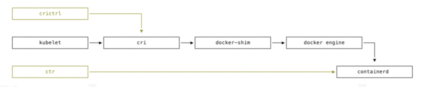
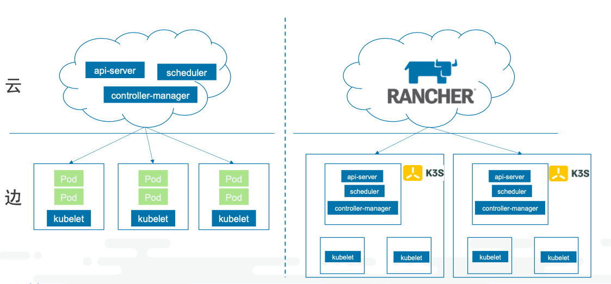
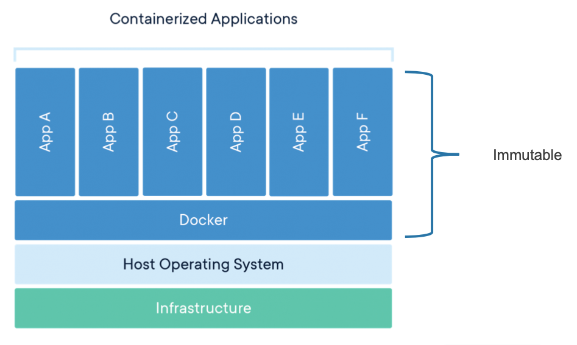

### 什么是 k3s？

k3s 是微型的 kubernetes 发行版本

1. CNCF 认证的 Kubernetes 发行版
2. 50MB 左右二进制包，500MB 左右内存消耗
3. 单一进程包含 Kubernetes master, Kubelet, 和 containerd
4. 支持 SQLite/Mysql/PostgreSQL/DQlite 和 etcd
5. 同时为 x86_64, Arm64, 和 Armv7 平台发布

### k3s 基本架构

#### 整体架构

##### 部署架构


轻量化

相比 k8s
移除

- 删除旧的和非必要的组件
- alpha feature
- In-tree cloud providers
- In-tree storage strivers
- Docker (optional)

增加

- 简单的安装
- etcd 默认使用 SQLite 做数据源
- TLS 管理
- 自动 helm chart 管理
- containerd、cordons、Flannel 集成

##### k3s 代码结构


注意事项：

- contaienrd 是独立进程，也可以使用 docker
- Tunnel Proxy 负责维护 k3s server 和 k3s agent 之间的链接，采用 Basic Auth 的方式来进行认证

##### Demo

k3s 进程

- server

\# 6443 k3s server, 6444 api-server

- agent

```
pstree -p -aT $pid
ps -T $pid
```

##### 参考链接

- [k3s 代码组织结构分析参考](https://mp.weixin.qq.com/s/1o9X0Dlv2WhUS6iC9P-KQA)
- [k3s 部署参考](https://mp.weixin.qq.com/s/V-VyWrCZux5WXxD__QpEWQ)
- [k3s 为何轻量](https://mp.weixin.qq.com/s/5aprEfYSWJyVoW4trDp4Hw)

#### k3s 的高可用架构


##### 高可用 - 外置数据库

- PostgreSQL (v10.7、v11.5) ü
- MySQL (v5.7)
- etcd (v3.3.15)

实现方式：
rancher/kine


##### 高可用 - 分布数据库

**SQLite**

- 软件库，无独立进程:C 语言编写
- 零管理配置:不需要服务管理进程
- 事务安全:兼容 ACID，可并发访问
- 标准 SQL 支持
- 单一磁盘文件

k3s 默认使用
`/var/lib/rancher/k3s/server/db/state.db`

**Dqlite**

- 软件库，无独立进程:C 语言编写
- 分布式一致:C-Raft 实现
- 兼容 SQLite

Dqlite 原理

- 一个 k3sserver 进程内含 SQL 的 client 组 件和 server 组件
- client 仅连接一个 server
- server 链接 SQLite 软件库
- 奇数个 k3sserver 进程
- client 需连接所有 server
- server 链接 Dqlite 软件库
- server 通过 C-Raft 来选主
- client 发现 主 server
- client 把请求都发送到主 server
- 主 server 通过 C-Raft 给从 server 发送差分日志作为数据同步


##### 参考链接

- [SQLite 基础命令](https://www.runoob.com/sqlite/sqlite-commands.html)
- [SQLite Go 语言驱动实现](https://github.com/mattn/go-sqlite3)
- [CGO 的动静态链接介绍](https://books.studygolang.com/advanced-go-programming-book/ch2-cgo/ch2-06-static-shared-lib.html)
- [Dqlite 讲解](https://fosdem.org/2020/schedule/event/dqlite/)
- [Raft 协议介绍](https://raft.github.io/)
- [k3s 社区高可用介绍](https://mp.weixin.qq.com/s/3by95UIJ7v41KXElt7uvGA)

#### Containerd

`Containerd`的设计目的是嵌入更大的系统

Docker 的历史

- 1.8 之前:docker -d - 2015 年，OCI 成立
- 1.8 - 1.11:docker daemon - runtime-spec 制定
- 1.11 以后:docker、dockerd - libcontainer -> runC
- dockerd = docker engine + containerd + containerd-shim + runC





**操作**

| 镜像操作       | Docker         | ContainerD         |
| :------------- | :------------- | :----------------- |
| 本地镜像列表   | docker images  | crictl images      | ctr images list |
| 下载镜像       | docker pull    | crictl pull        | ctr (images) pull |
| 上传镜像       | docker push    |                    | ctr (images) push |
| 删除本地镜像   | docker rmi     | crictl rmi         | ctr images remove |
| 标记本地镜像   | docker tag     |                    | ctr (images) tag |
| 镜像详情       | docker inspect | crictl inspecti    |
| 容器列表       | docker ps      | crictl ps          | ctr containers list |
| 创建容器       | docker create  | crictl create      | ctr containers create |
| 运行容器       | docker start   | crictl start       | ctr (tasks) start |
| 停止容器       | docker stop    | crictl stop        | ctr (tasks) pause |
| 删除容器       | docker rm      | crictl rm          | ctr (tasks) rm |
| 容器详情       | docker inspect | crictl inspect     |
| 连接容器       | docker attach  | crictl attach      | ctr (tasks) attach |
| 容器内操作     | docker exec    | crictl exec        | ctr (tasks) exec |
| 容器日志       | docker logs    | crictl logs        |
| 容器状态       | docker stats   | crictl stats       |
| 显示 POD 列表  |                | crictl pods        |
| 查看 POD 详情  |                | crictl inspectp    |
| 运行 POD       |                | crictl runp        |
| 停止 POD       |                | crictl stopp       |
| 删除 POD       |                | crictl rmp         |
| 转发端口到 POD |                | crictl port-foward |

k3s 内置 containerd

- ctr : 单纯的容器管理
- crictl : 从 Kubernetes 视角出发，对 POD、容器进行管理

k3s 修改 containerd 配置
修改`/var/lib/rancher/k3s/agent/etc/containerd/config.toml`同目录下`config.toml.tmpl`文件，重启 k3s

contaienrd 日志
`/var/lib/rancher/k3s/agent/containerd/containerd.log`

##### 参考链接

- [cri 的演进史](https://zhuanlan.zhihu.com/p/87602649)
- [runC 的介绍](https://www.infoq.cn/article/docker-standard-container-execution-engine-runc)
- [k3s 社区 Containerd 使用介绍](https://mp.weixin.qq.com/s/EJqS7G36f7_srgxSZaCuPw)
- [crictl 基本操作](https://github.com/kubernetes-sigs/cri-tools/blob/master/docs/crictl.md)
- [Containerd CNI 插件配置介绍](https://github.com/containerd/cri/blob/master/docs/config.md)

### k3s 拓展功能概览

#### Helm Controller

- k3s Helm Controller 同时支持 v2 与 v3 版本
  - 从 v1.17.0+k3s1 or above 默认使用 helm_v3
- Helm v2 vs Helm v3
  - 移除了 Tiller(from SA to kubeconfig)
  - 三方会谈 (Three-way Strategic merge patch)
  - 使用 Secret 作为默认存储
  - crd-install hook 迁移到了 crds/路径等...
- Helm Controller 的优势

  - 更方便的用户体验
  - HelmChart CRD 可以支持更丰富的拓展

**设计原理**

1. Helm-controller 运行在 master 节点并 list/watch HelmChart CRD 对象
2. CRD onChange 时执行 Job 更新
3. Job Container 使用 rancher/kilipper-helm 为 entrypoint
4. Killper-helm 内置 helm cli，可以安装/升级/删除对应的 chart

```yaml
apiVersion: helm.cattle.io/v1
kind: HelmChart
metadata:
  name: traefik
  namespace: kube-system
spec:
  chart: stable/traefik
  set:
    rbac.enabled: 'true'
    ssl.enabled: 'true'
```

- K3s 会自动部署在/var/lib/rancher/k3s/server/manifests 路径下的 HelmChart
- 通过 HelmChart CRD 部署的 chart 是兼容 helm v3 CLI 的
- 在 k3s 中管理和部署 Helm 应用

相关工具包 - rancher/helm-controller - rancher/kilipper-helm

#### Traefik LB

K3s 支持模块化的开启或关闭相关组件，例如 Traefik LB, Scheduler, servicelb 等

- curl -sfL https://get.k3s.io | sh -s - server --no-deploy=traefik
- k3s server --no-deploy=traefik --no-deploy=servicelb
- 也可通过修改 k3s.service 配置然后重启生效

##### Service LB Controller 设计原理

Service LB 是 Rancher 针对 k3s 集群而设计的一种 service loadbalancer controller，
用户可通过将 Service 的 type 类似配置为 LoadBalancer 来使用。

1. svc-controller watch 到 service 类型为 LoadBalancer 时，自动创建一个 Daemonset;
2. 默认 Daemonset 会部署到每个节点，如果任意 Node 设定了 label svccontroller.k3s.cattle.io/enablelb=true,
   则只在拥有这个 label 的 node 上 创建 DS 的 pod;
3. 对于某个部署的节点，一个 LB port 只会对应一个 POD， 端口不能重复使 用;
4. 若创建失败或无可用端口时，service 的状态为 Pending

##### 本地存储

- K3s 默认添加了 local path provisioner

- Local path provisioner 是基于 Kubernetes Local Persistent Volume 功能实现的一个本地动态存储管理器

  - 默认 host path 路径为/var/lib/rancher/k3s/storage
  - 配置文件存放在 kube-system 下的 local-path-config configmap
  - 支持动态创建 host path volumes
  - 不支持 capacity limit

### k3s 与 GPU 结合使用

#### 从 AI 视角看计算的三个层次

云计算:

- 最通用的计算
- 算力要求高，实时性要求低
- 执行复杂的认知计算和模型训练
  通用操作系统/海量 GPU 卡

边缘计算

- 连接云和端，针对端做特定 优化
- 执行推理和数据融合处理
  通用操作系统/数量有限的 GPU 卡/专业 AI 芯片

端计算

- 场景相关性强
- 极致效率，实时性要求高
- 主要面向推理
  实时操作系统/专业 AI 芯片

#### Kuberntes 正成为机器学习的主流基础设施平台


k3s 的优势

- K3s 足够轻量，减小边缘基础设施服务的资源占用
- K3s 部署运维足够简单，用户可以专注 GPU 和计算框架的管理

#### Docker 容器中的 GPU


#### k3s 使用 GPU 设备的原理

1. 操作系统安装支持 Nvidia Driver
2. 安装容器运行时，并切换 runtime 到 nvidia
3. K8s 通过 gpu-device-plugin 来获取 GPU 资源并记录在 k8s 中
4. Pod 通过在 k8s 内申请 gpu 资源，kubelet 驱 动 runtime 把一定额度的 GPU 卡分配给它

```yaml
resources:
  limits:
    nvidia.com/gpu: '1'
```

##### Demo 演示 GPU

- 准备 GPU 主机，安装 cuda-drivers
- 安装 nvidia-docker2
- 安装 k3s
- 安装 gpu-device-plugin
- 测试 GPU workload

#### 当前的问题和展望

##### 容器中对 GPU 的资源分配还不太灵活

- GPU 资源分配只能整数增减(可通过 Tensorflow 间接细化显存资源分配)
- NVIDIA docker 不支持 vGPU(kubevirt 虚拟化方式可支持)

##### AI 场景:云边文件传输的痛点

- 边缘 AI 训练特点:海量小文件 IO 性能要求
- 与云端同步数据的网络带宽消耗(断点续传)

### K3s 的 IoT 场景管理

#### 什么是边缘计算?

边缘计算是指在靠近智能设备或数据源头的一端，
提供`网络`、 `存储`、`计算`、`应用`等能力，
达到*更快的网络服务响应，更安 全的本地数据传输*。

#### 边缘场景的 k8s 用例正在不断涌现

- 1106 个有效问卷
- 15%的受访者表示，正在把 Kubernetes 应用在边缘计算场景中
- Chick-fil-A [Link](https://medium.com/@cfatechblog/bare-metal-k8s-clustering-at-chick-fil-a-scale-7b0607bd3541)

#### 边缘计算的问题与挑战

- 边缘设备种类繁多
- 繁琐的版本管理
- 复杂的跨域环境
- 成百上千部署在边缘侧的应用

- 统一和可持续化迭代的管理 平台
- 继承了强大的 k8s 社区和生 态
- 边缘节点独立自制，云端系统统一管理

#### k3s 云边协作模式




#### k3s 案例


#### K3s 与 IoT 设备管理


1. 创建并纳管边缘 k3s 集群
2. 部署 MQTT Broker 到 k3s 集群
3. 创建、部署 IoT 设备相关的应用
4. 基于 MQTT 实现设备联动

### K3S 周边介绍

#### 实例化 k3s 集群的工具

- K3sup(https://github.com/alexellis/k3sup) -
  VM 实例中运行 k3s
  - 具备隔离型，但依赖公有云服务
- K3s-ansible(https://github.com/itwars/k3s-ansible)
  - 依赖用户对机器环境访问权限
  - 依赖 ansible
- Multipass-k3s
  - 依托 multipass 本身对虚拟机的管理

#### K3d - 依托 Docker 的 k3s 管理工具

[k3d 项目](https://github.com/rancher/k3d)

- K3s 本身被置于容器中
- 容器中类似是 Docker-in-Docker 原理(https://hub.docker.com/_/docker)
- 实际是 k3s(containerd)-in-Docker
- K3d 整合各种 use cases，方便通过 CLI 创建 k3s 集群

K3d 带来的好处

- 管理容器一样管理 k3s 集群
- 给每个开发者本地 k3s 环境，方便调试应用
- https://github.com/rancher/k3d/tree/master/docs

#### 不可变基础设施

Immutable Infrastructure


##### VM 实现了早期的构想

- VM 镜像过于笨重，且无法做版本控制
- 对异构环境不友好
- 用户习惯无法被约束，依然会在线进行部分更新操作

##### 不可变基础设施 1.0 --- 容器技术(Docker)

- 解决环境间差异问题
- 快速回滚到老版本
- 更好的进行 CI
- 更好的自动化
- 更容易进行大规模运维



##### 不可变基础设施 2.0 -- Immutable OS

硬件之上全部为 **“不可变”**

更复杂更高级的云原生应用的更新，不仅仅依赖 RootFS 变更，更需要内核的同步更新。

操作系统也应成为不可变基础设施的一部分，保证基础架构更高的一致性和可靠性，以及更加方便运维管理。


##### Docker native 正在向 Kubernetes native 演变

Immutable OS 也紧跟趋势

Immutable OS for Docker:

- RancherOS
- Atomic
- CoreOS
- Photon OS

Immutable OS for Kubernetes:

- K3os
- Bottlerocket-os
- Talos

##### K3os – An Immutable OS For App


###### system-upgrade-controller

- 使用 Kubernets 方式管理 OS 升降级
- 未来会集成在 Rancher2.x 中

#### k3c - Classic Docker for a Kubernetes world

与 Docker 比

1. 相似的交互
2. singlebinary
3. 同样内置 containerd 4. 更加轻量化

与 Crictl 比

1. 满足 CRI 规范
2. 支持 image tag/push
3. 支持 image build
