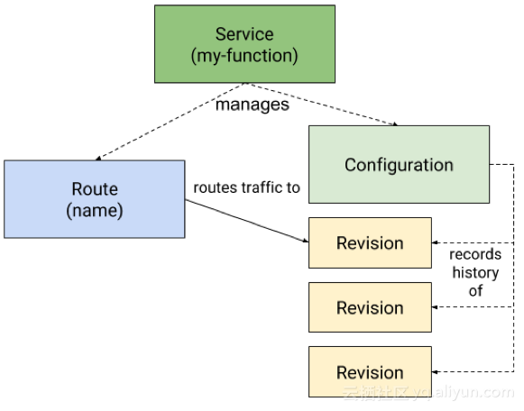
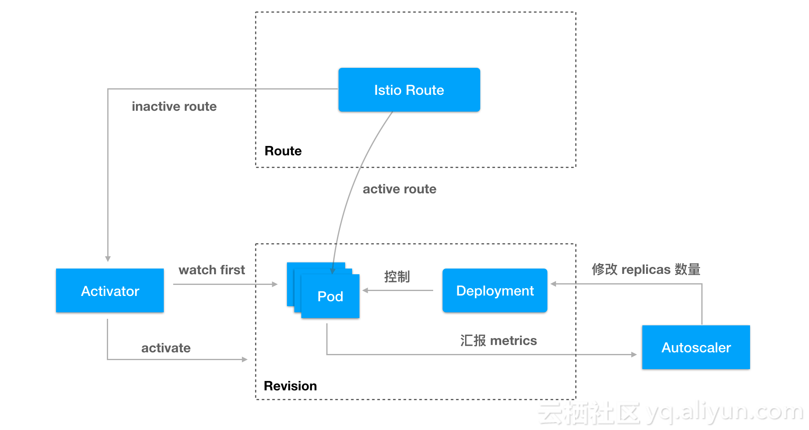

### 什么是 Knative？

基于`Kubernetes`的平台，用于构建，部署和管理现代无服务器工作负载。

knative 于 2018 年 7 月 24 日对外发布，是谷歌开源的 `serverless`架构方案，旨在提供一套简单易用的 `serverless`方案，把 `serverless` 标准化。目前参与的公司主要是 Google、Pivotal、IBM、Red Hat，。

`Knative`让开发人员更高效
`Knative`组件构建于`Kubernetes`之上，抽象出复杂的细节，使开发人员能够专注于重要的事情。
通过编写成功的实际实现共享的最佳实践，`Knative`解决了构建，部署和管理云本机服务的“无聊但困难”的部分。

##### 亮点：

- 针对常见应用程序用例提供更高级别抽象 API
- 在几秒钟内即可提供可扩展，安全，无状态的服务
- 松散耦合的特性，可以只使用需要的部分
- 可插拔组件，可以使用自定的日志、监控、网络和 service mesh
- Knative 可以在任何 k8s 运行的平台运行
- 一致的开发体验，支持通用模式：GitOps, DockerOps, ManualOps.
- Knative 可以与常见的工具和框架一起使用，例如 Django，Ruby on Rails，Spring 等等。

### knative 核心概念和原理

为了实现 serverless 应用的管理，knative 把整个系统分成了三个部分：

- Build：构建系统，把用户定义的函数和应用 build 成容器镜像
- Serving：服务系统，用来配置应用的路由、升级策略、自动扩缩容等功能
- Eventing：事件系统，用来自动完成事件的绑定和触发

##### Build 构建系统

build 的功能是把用户的代码自动化构建成容器镜像

Knative 的特别之处在于两点：一是它的构建完成是在 kubernetes 中进行的，和整个 kubernetes 生态结合更紧密；另外，它旨在提供一个通用的标准化的构建组件，可以作为其他更大系统中的一部分。

根据官方文档中的说的，是为了定义标准化、可移植、可重用、性能高效的构建方法.

##### Serving：服务系统

serving 的核心功能是让应用运行起来提供服务。虽然听起来很简单，但这里包括了很多的事情：

自动化启动和销毁容器
根据名字生成网络访问相关的 service、ingress 等对象
监控应用的请求，并自动扩缩容
支持蓝绿发布、回滚功能，方便应用方法流程

knative serving 功能是基于 kubernetes 和 istio 开发的，它使用 kubernetes 来管理容器（deployment、pod），istio 来管理网络路由（VirtualService、DestinationRule）。

因为 kubernetes 和 istio 本身的概念非常多，理解和管理起来比较困难，knative 在此之上提供了更高一层的抽象（这些对应是基于 kubernetes 的 CRD 实现的）。这些抽象出来的概念对应的关系如下图：



- Configuration：应用的最新配置，也就是应用目前期望的状态，对应了 kubernetes 的容器管理（deployment）。每次应用升级都会更新 configuration，而 knative 也会保留历史版本的记录（图中的 revision），结合流量管理，knative 可以让多个不同的版本共同提供服务，方便蓝绿发布和滚动升级
- Route：应用的路由规则，也就是进来的流量如何访问应用，对应了 istio 的流量管理（VirtualService）
- Service：注意这里不是 kubernetes 中提供服务发现的那个 service，而是 knative 自定义的 CRD，它的全称目前是 services.serving.knative.dev 。单独控制 route 和 configuration 就能实现 serving 的所有功能，但 knative 更推荐使用 Service 来管理，因为它会自动帮你管理 route 和 configuration

**knative serving 各组件之间的关系：**



可以看到，每个 revision 对应了一组 deployment 管理的 pod
pod 会自动汇报 metrics 数据到 autoscaler，autoscaler 会根据请求量和资源使用情况修改 deployment 的 replicas 数量，从而实现自动扩缩容。serverless 一个重要的特定是它会 scale to 0 的，也就是当应用没有流量访问时，它会自动销毁所有的 pod
activator 比较有趣，它是为了处理 scale to 0 而出现的。当某个 revision 后面的 pod 缩容到 0 时，route 的流量会指向 activator，activator 接收到请求之后会自动拉起 pod，然后把流量转发过去
route 对象对应了 istio 的 DestinationRoute 和 VirtualService，决定了访问应用的流量如何路由

##### Eventing：事件系统

serving 系统实现的功能是让应用/函数能够运行起来，并且自动伸缩，那什么时候才会调用应用呢？除了我们熟悉的正常应用调用之外，serverless 最重要的是基于事件的触发机制，也就是说当某件事发生时，就触发某个特定的函数。

事件概念的出现，让函数和具体的调用方能够解耦。函数部署出来不用关心谁会调用它，而事件源触发也不用关心谁会处理它。

Knative Eventing 是一个旨在满足云原生开发的常见需求的系统，并提供可组合的原语以支持后期绑定事件源和事件使用者。

Knative Eventing 围绕以下目标设计：

1. Knative Eventing 服务松散耦合。这些服务可以在各种平台上独立开发和部署（例如 Kubernetes，VM，SaaS 或 FaaS）。
2. Event 的生产者和消费者是独立的。任何生产者（或源）都可以在有正在侦听的 Event 事件使用者之前生成 Event。在有创建这些 Event 的生产者之前，任何 Event 消费者都可以选择侦听的事件或事件类别。
3. 其他服务可以连接到 Eventing 系统。这些服务可以执行以下功能：
   - 创建新的应用不需要修改事件的生产者何消费者
   - 从生产者选择和标记指定的时间集合
4. 确保跨服务互操作性。 Knative Eventing 与 CNCF 无服务器工作组开发的 CloudEvents 规范一致。

### 安装 Knative

Knative 依赖于 Ingress/Gateway，它能够将请求路由到 Knative Services。 目前，存在两种提供此功能的选项：

- Istio，基于 Envoy 的 Service Mesh
- Gloo，基于 Envoy 的 API Gateway。

安装过程：

1. 安装 istio
2. 安装 Knative

#### 首先安装 CRD

label knative.dev/crd-install=true，可以防止安装过程中的竞争条件，而导致间歇性错误

```shell
   kubectl apply --selector knative.dev/crd-install=true \
   --filename https://github.com/knative/serving/releases/download/v0.7.0/serving.yaml \
   --filename https://github.com/knative/build/releases/download/v0.7.0/build.yaml \
   --filename https://github.com/knative/eventing/releases/download/v0.7.0/release.yaml \
   --filename https://github.com/knative/serving/releases/download/v0.7.0/monitoring.yaml
```

要完成 Knative 及其依赖项的安装，请再次运行 kubectl apply 命令，这次没有--selector 标志，以完成 Knative 及其依赖项的安装

```shell
   kubectl apply --filename https://github.com/knative/serving/releases/download/v0.7.0/serving.yaml --selector networking.knative.dev/certificate-provider!=cert-manager \
   --filename https://github.com/knative/build/releases/download/v0.7.0/build.yaml \
   --filename https://github.com/knative/eventing/releases/download/v0.7.0/release.yaml \
   --filename https://github.com/knative/serving/releases/download/v0.7.0/monitoring.yaml
```

如果所有组件状态为你 running，确认安装成功

```shell
   kubectl get pods --namespace knative-serving
   kubectl get pods --namespace knative-build
   kubectl get pods --namespace knative-eventing
   kubectl get pods --namespace knative-monitoring
```
