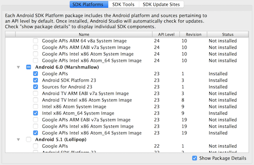

## React Native 环境安装 iOS

### 基础开发环境环境安装：

```shell
brew install node
brew install watchman

yarn global add react-native-cli
# or
npm install -g react-native-cli

```

### iOS 开发环境环境安装：

需要安装 XCode
版本大于 8

#### 创建项目

使用 `react-native` 命令行工具创建项目

```shell

react-native init vultr-ping

```

#### 创建 iOS 和 Android 项目

```shell

react-native eject

```

#### 启动 iOS 开发

```shell

react-native run-ios

```

#### 创建项目图标

[详细介绍](https://github.com/bamlab/generator-rn-toolbox/blob/master/generators/assets/README.md)

```shell
brew install imagemagick
yarn global add yo generator-rn-toolbox

yo rn-toolbox:assets --icon icon.png

```

#### iOS 开发注意

- iOS 开发只能使用 https 链接获取数据

- iOS 开发网络链接库可以使用 `XMLHttpRequest` 或者 `fetch` API

- 可以使用 _Redux_ 库来管理状态，支持原生 JavaScript 库

- \*可以和 iOS 原生代码混合开发

### Android 开发环境安装：

需要安装 _Java SE_
版本 8.0 以上

需要安装 _Android SDK_

需要安装 _Android Stuido_

```shell

brew cask install java
brea cask install android-sdk
brea cask install android-studio

```

React Native 需要配置环境变量

```shell

export ANDROID_HOME=$HOME/Library/Android/sdk
export PATH=$PATH:$ANDROID_HOME/tools
export PATH=$PATH:$ANDROID_HOME/platform-tools

```

Android Studio 需要配置 Android SDK




