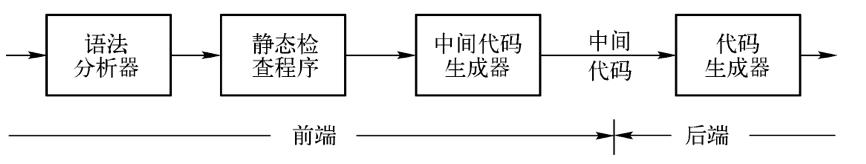

构建一个简单的编译器, 将 List 格式的代码转换成 C 格式的

原始代码

```lisp
(plus 3 (abstract 9 6))
```

### 编译器

一个编译器的前端模型



根据编译过程来解决这个问题

1. 生成`tokens`
2. 根据`tokens`生成`ast`
3. 转换`ast`到`newAst`
4. 从`newAst`生成代码

### Tokenizer

将源代码转换为`token`流

```js
const tokenizer = input => {
  let pos = 0;
  let tokens = [];
  while (pos < input.length) {
    let char = input[pos];

    const PAREN_MATCH = /[\(\)]/;
    if (PAREN_MATCH.test(char)) {
      tokens.push({ type: 'paren', value: char });
      pos++;
      continue;
    }

    const NAME_MATCH = /[a-zA-Z_]/;
    const NAME_MATCH_ = /[a-zA-Z0-9_]/;
    if (NAME_MATCH.test(char)) {
      let verb = char;
      while (NAME_MATCH_.test(input[++pos])) {
        verb += input[pos];
      }
      tokens.push({ type: 'name', value: verb });
      continue;
    }

    const NUM_MATCH = /[0-9]/;
    if (NUM_MATCH.test(char)) {
      let verb = char;
      while (NUM_MATCH.test(input[++pos])) {
        verb += input[pos];
      }
      tokens.push({ type: 'number', value: verb });
      continue;
    }

    const WHITE_SPACE = /\s/;
    if (WHITE_SPACE.test(char)) {
      pos++;
      continue;
    }
    throw new Error(`Unexpect token at ${pos}`);
  }
  return tokens;
};

module.exports = tokenizer;
```

### Parser

将`token`流转换为`AST`

```js
const parser = tokens => {
  let current = 0;

  const walk = () => {
    let token = tokens[current];

    if (token.type === 'number') {
      current++;

      return {
        type: 'NumberLiteral',
        value: token.value,
      };
    }

    if (token.type === 'paren' && token.value === '(') {
      token = tokens[++current];

      let node = {
        type: 'CallExpression',
        name: token.value,
        params: [],
      };

      token = tokens[++current];

      while (
        token.type !== 'paren' ||
        (token.type === 'paren' && token.value !== ')')
      ) {
        node.params.push(walk());
        token = tokens[current];
      }

      current++;

      return node;
    }
    throw new TypeError(token.type);
  };

  let ast = {
    type: 'Program',
    body: [],
  };

  while (current < tokens.length) {
    ast.body.push(walk());
  }

  return ast;
};

module.exports = parser;
```

### Traverser and Transformer

`Traverser` 提供了遍历 AST 的方法

`Transformer` 通过 `Traverser` 遍历语法树来修改 `AST`

#### Traverser

```js
const traverser = (ast, visitor) => {
  const traverseArray = (array, parent) => {
    array.forEach(child => {
      traverseNode(child, parent);
    });
  };

  const traverseNode = (node, parent) => {
    let methods = visitor[node.type];

    if (methods && methods.enter) {
      methods.enter(node, parent);
    }

    switch (node.type) {
      case 'Program':
        traverseArray(node.body, node);
        break;

      case 'CallExpression':
        traverseArray(node.params, node);
        break;

      case 'NumberLiteral':
        break;

      default:
        throw new TypeError(node.type);
    }

    if (methods && methods.exit) {
      methods.exit(node, parent);
    }
  };

  traverseNode(ast, null);
};

module.exports = traverser;
```

#### Transformer

```js
const traverser = require('./traverser');

const transformer = ast => {
  let newAst = {
    type: 'Program',
    body: [],
  };

  ast._context = newAst.body;

  traverser(ast, {
    NumberLiteral: {
      enter(node, parent) {
        parent._context.push({
          type: 'NumberLiteral',
          value: node.value,
        });
      },
    },
    CallExpression: {
      enter(node, parent) {
        let expression = {
          type: 'CallExpression',
          callee: {
            type: 'Identifier',
            name: node.name,
          },
          arguments: [],
        };

        node._context = expression.arguments;

        if (parent.type !== 'CallExpression') {
          expression = {
            type: 'ExpressionStatement',
            expression: expression,
          };
        }

        parent._context.push(expression);
      },
    },
  });

  return newAst;
};

module.exports = transformer;
```

### Code Generator

将`AST`重新生成为代码

```js
const codeGenerator = node => {
  switch (node.type) {
    case 'Program':
      return node.body.map(codeGenerator).join('\n');

    case 'ExpressionStatement':
      return codeGenerator(node.expression) + ';';

    case 'CallExpression':
      return (
        codeGenerator(node.callee) +
        '(' +
        node.arguments.map(codeGenerator).join(', ') +
        ')'
      );

    case 'Identifier':
      return node.name;

    case 'NumberLiteral':
      return node.value;

    default:
      throw new TypeError(node.type);
  }
};

module.exports = codeGenerator;
```
